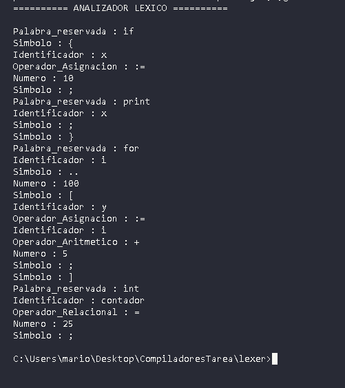

EXPLICACION DEL ANALIZADOR LEXICO

1. QUE ES:
   - Un programa que reconoce tokens en código fuente
   - Toma como entrada un archivo con código
   - Identifica: palabras reservadas, identificadores, números, operadores, símbolos

2. COMPONENTES:
   - AnalizadorLexer.g4: Define QUE es cada token
   - LexerDriver.java: Lee el archivo y procesa los tokens
   - AnalizadorLexer.java: Generado por ANTLR (máquina de estados)

3. TOKENS RECONOCIDOS:
   ✓ Palabras reservadas: if, else, for, print, int, asdfg
   ✓ Identificadores: máximo 10 caracteres, comienzan con letra
   ✓ Números: 0-100
   ✓ Operadores: +, -, *, /, :=, >=, <=, >, <, =, <>
   ✓ Símbolos: {, }, [, ], (, ), ,, ;, ..

4. EJEMPLO:
   Entrada: if { x := 10; }
   Salida:
   Palabra_reservada : if
   Simbolo : {
   Identificador : x
   Operador_Asignacion : :=
   Numero : 10
   Simbolo : ;
   Simbolo : }

   

   